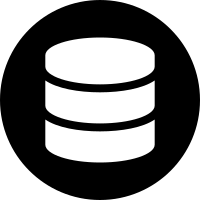

Database Extra
==============

Aplus Framework Database Extra Library.

- `Installation`_
- `Introduction`_
- `Migrations`_
- `Seeding`_
- `Conclusion`_

Installation
------------

The installation of this library can be done with Composer:

.. code-block::

    composer require aplus/database-extra

Introduction
------------

The Database Extra library provides tools for working with database migrations
and seeding.

Migrations
----------

Migrations works like a database versioning.

With them, you can manage schemas and tables. Up and down for a given version.

The migration files are according to the template below:

.. code-block:: php

    use Framework\Database\Extra\Migration;
    
    return new class() extends Migration
    {
        public function up() : void
        {
            //
        }
    
        public function down() : void
        {
            //
        }
    };

In the ``up`` method, the creation and modification of schemas and tables must be
performed. 
While in the ``down`` method, the opposite way is carried out, undoing the
modifications carried out in the up method.

The file names must follow an order, in which the migrations will go up and down.

You can use the date and time as a prefix and a brief description. For example:

``2022_05_26_213000_create_table_users.php``

Another way is simply numbering the start of the migration file. For example:

``100_create_table_users.php``

The important thing is that each migration system has its own standard.

In the examples that we will see, we will use a number as a prefix and a brief
description.

Inside the migration directory, we create the ``100_create_table_users.php`` file:

**migrations/100_create_table_users.php**

.. code-block:: php

    use Framework\Database\Definition\Table\TableDefinition;
    use Framework\Database\Extra\Migration;
    
    return new class() extends Migration
    {
        protected string $table = 'Users';
    
        public function up() : void
        {
            $this->getDatabase()->createTable($this->table)
                ->definition(function (TableDefinition $def) {
                    $def->column('id')->int()->primaryKey()->autoIncrement();
                    $def->column('name')->varchar(32);
                    $def->column('birthday')->date();
                })->run();
        }
    
        public function down() : void
        {
            $this->getDatabase()->dropTable($this->table)->ifExists()->run();
        }
    };
 
This file creates the Users table in the ``up`` method and drop it in the ``down`` method.

The file below creates the Posts table, which will run after
100_create_table_users, due to it starting with the number 200.

**migrations/200_create_table_posts.php**

.. code-block:: php

    use Framework\Database\Definition\Table\TableDefinition;
    use Framework\Database\Extra\Migration;
    
    return new class() extends Migration
    {
        protected string $table = 'Posts';
    
        public function up() : void
        {
            $this->getDatabase()->createTable($this->table)
                ->definition(function (TableDefinition $def) {
                    $def->column('id')->int()->primaryKey()->autoIncrement();
                    $def->column('userId')->int()->null();
                    $def->column('title')->varchar(128);
                    $def->column('contents')->text();
                    $def->column('createdAt')->timestamp();
                    $def->index()
                        ->foreignKey('userId')
                        ->references('Users', 'id')
                        ->onDelete('SET NULL')
                        ->onUpdate('CASCADE');
                })->run();
        }
    
        public function down() : void
        {
            $this->getDatabase()->dropTable($this->table)->ifExists()->run();
        }
    };

In the next example, let's change the Users table, adding two columns to it on
the way up and removing them on the way down:

**migrations/300_alter_table_users.php**

.. code-block:: php

    use Framework\Database\Definition\Table\TableDefinition;
    use Framework\Database\Extra\Migration;
    
    return new class() extends Migration
    {
        protected string $table = 'Users';
    
        public function up() : void
        {
            $this->getDatabase()->alterTable($this->table)
                ->add(function (TableDefinition $def) {
                    $def->column('email')->varchar(255)->after('id');
                    $def->column('password')->varchar(255);
                })->run();
        }
    
        public function down() : void
        {
            $this->getDatabase()->alterTable($this->table)
                ->dropColumnIfExists('email')
                ->dropColumnIfExists('password')
                ->run();
        }
    };

The files must return an instance of the ``Framework\Database\Extra\Migration``
class to run in a Migrator.

Migrator
########

Migrations are performed in a Migrator instance.

To instantiate it, you need a Database instance and at least one directory where
the migrations are stored.

.. code-block:: php

    use Framework\Database\Database;
    use Framework\Database\Extra\Migrator;

    $database = new Database('root', 'password', 'app');
    
    $directories = [
        __DIR__ . '/migrations',
    ];

    $migrator = new Migrator($database, $directories);

Once this is done, you can move the versioning of the migrations.

Migrate Up
^^^^^^^^^^

The ``migrateUp`` method runs migrations up.

Each time it runs the migration up method, it gives the migration name:

.. code-block:: php

    foreach($migrator->migrateUp() as $name) {
        echo $name . PHP_EOL;
    }

Migrate Down
^^^^^^^^^^^^

It is also possible to go down to undo all migrations:

.. code-block:: php

    foreach($migrator->migrateDown() as $name) {
        echo $name . PHP_EOL;
    }

Or, go down only a specific amount, as in the example below, going down only
3 migrations.

.. code-block:: php

    foreach($migrator->migrateDown(3) as $name) {
        echo $name . PHP_EOL;
    }

Migrate To
^^^^^^^^^^

With the ``migrateTo`` method you can automatically move to a certain version. 
It will go up or down migrations according to the current version.

.. code-block:: php

    foreach($migrator->migrateTo('2022_05_26_123000') as $name) {
        echo $name . PHP_EOL;
    }

Seeding
-------

Seeding is a way of inserting data into database tables for testing purposes.

A Seeder is the class for performing this task.

They must extend the ``Framework\Database\Extra\Seeder`` class and perform data
insertion in the ``run`` method:

.. code-block:: php

    use Framework\Database\Extra\Seeder;
    
    class SeederName extends Seeder
    {
        public function run() : void
        {
            //
        }
    }

Let's look at an example for inserting data into the Users table:

**UsersSeeder.php**

.. code-block:: php

    use Framework\Database\Extra\Seeder;
    
    class UsersSeeder extends Seeder
    {
        public function run() : void
        {
            $this->getDatabase()->insert('Users')
                ->columns('name', 'birthday', 'email', 'password')
                ->values([
                    [
                        'Seiya',
                        '2009-12-01',
                        'pegasus@kz.tld',
                        password_hash('password', PASSWORD_DEFAULT),
                    ],
                    [
                        'Shiryu',
                        '2008-10-04',
                        'dragon@kz.tld',
                        password_hash('password', PASSWORD_DEFAULT),
                    ],
                    [
                        'Hyoga',
                        '2008-01-23',
                        'cygnus@kz.tld',
                        password_hash('password', PASSWORD_DEFAULT),
                    ],
                    [
                        'Shun',
                        '2009-09-09',
                        'andromeda@kz.tld',
                        password_hash('password', PASSWORD_DEFAULT),
                    ],
                    [
                        'Ikki',
                        '2007-08-15',
                        'phoenix@kz.tld',
                        password_hash('password', PASSWORD_DEFAULT),
                    ],
                ])->run();
        }
    }

Each seeder can be executed individually, but all the seeders that will be
called can be defined in a class.

Let's see an example with the **DatabaseSeeder.php** file, which uses the ``call``
method to call and run other seeders:

.. code-block:: php

    use Framework\Database\Extra\Seeder;
    
    class DatabaseSeeder extends Seeder
    {
        public function run() : void
        {
            $this->call([
                UsersSeeder::class,
                PostsSeeder::class,
            ]);
        }
    }

Once this is done, just run the main seeder, which will call all the others to run:

.. code-block:: php

    use Framework\Database\Database;

    $database = new Database('root', 'password', 'app');

    $seeder = new DatabaseSeeder($database);
    $seeder->run();

Conclusion
----------

Aplus Database Extra Library is an easy-to-use tool for PHP developers, beginners and experienced. 
It is perfect for managing databases with versioning and tests with fake data. 
The more you use it, the more you will learn.

.. note::
    Did you find something wrong? 
    Be sure to let us know about it with an
    `issue <https://github.com/aplus-framework/database-extra/issues>`_. 
    Thank you!

